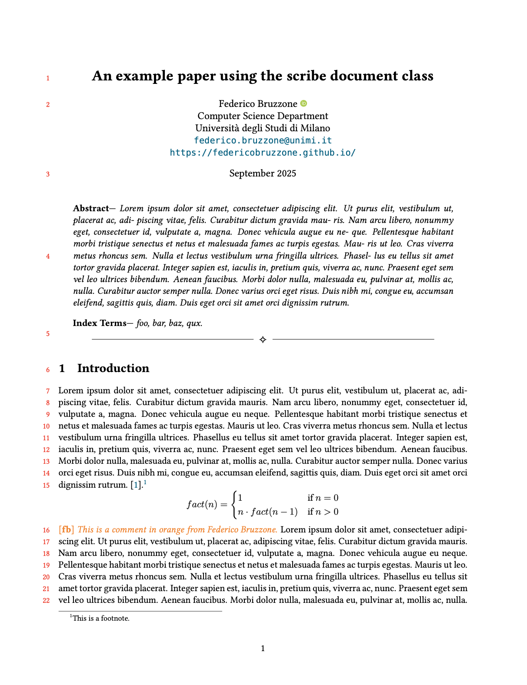
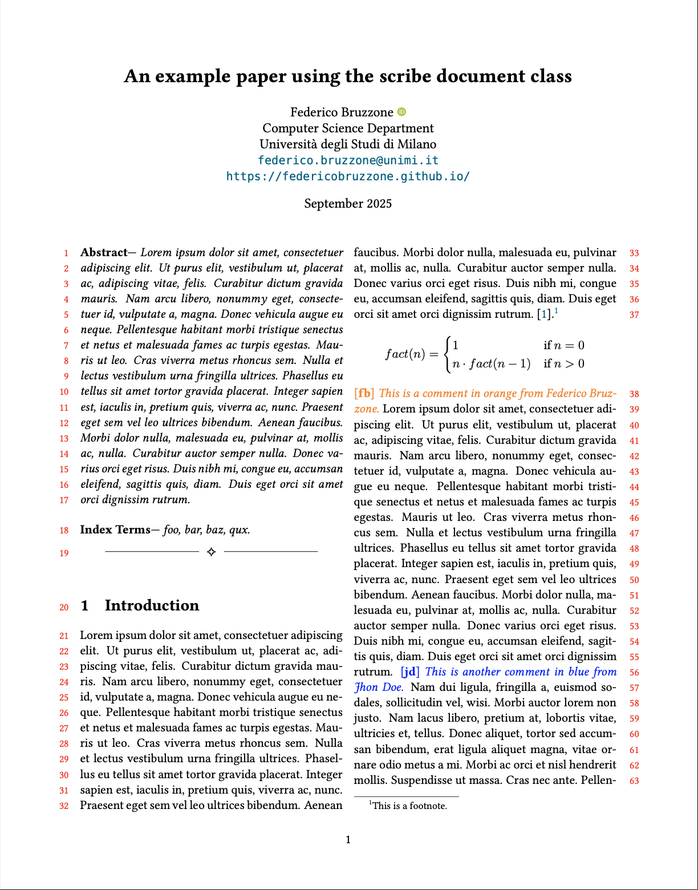

# `scribe`

**`scribe`** is a minimalist, opinionated $\LaTeX$ document class for academic and technical writing. It is designed to provide clean defaults, professional typography, and convenient commands for research papers, systematic literature reviews, and technical reports. It is partially inspired by the `acmart` class.

<!-- [](example/onecolumn.pdf) -->
<!-- [](example/twocolumns.pdf) -->

<p align="center">
  <a href="example/onecolumn.pdf">
    
  </a>
  &nbsp;&nbsp;&nbsp;
  <a href="example/twocolumns.pdf">
    
  </a>
</p>


---

## Features

- **Minimalist Design**: Focuses on content with a clean, professional layout.
- **Full support** for all standard `article` class options.
- **Line Numbers**: Optional line numbering for easy reference and review.
- **Citation style**:
    - Compact numeric citations (e.g., [1–3,5])
    - Sorted in order of **first appearance**, not numerically
- **Named inline comments (toggleable)**: 
    - Define with `\scribedefinecomment{name}{color}`
    - Use with `\namecomment{...}`
    - Disable globally with `\scribeshowcommentsfalse`
- **Custom header mark**: `\scribesetrightmark{...}` sets right-side header text
- **Typography**:
    - Serif: **Libertine**
    - Monospace: **Bera Mono**

---

## Usage

### 1. Add `scribe.cls` to your project folder.

### 2. In your main `.tex` file:

```latex
\documentclass[
    lineno, % Enable line numbers.
    letterpaper, % Use 'a4paper' for A4 size.
    % twocolumn, % Uncomment for two-column layout.
]{scribe} 

% Set right header mark (e.g., your name)
\scribesetrightmark{Federico Bruzzone} 

% Define different aliases (along with colors) for comments
\scribedefinecomment{fb}{orange}
% \scribedefinecomment{yourcolleague}{red}
% ...

% Uncomment the following line to hide comments in the final document.
% \scribeshowcommentsfalse 

\title{\textbf{An example paper using the scribe document class}}

\author{
    Federico Bruzzone \orcidlink{0000-0002-8701-8853} \\
    Computer Science Department \\
    Università degli Studi di Milano \\
    \href{mailto:federico.bruzzone@unimi.it}{\texttt{federico.bruzzone@unimi.it}} \\
    \url{https://federicobruzzone.github.io/} 
}

\date{September 2025}

\begin{document}

\maketitle

\begin{abstract}
   % Abstract text goes here. This is a brief summary of the document's content, highlighting the main objectives, methods, and findings.
\end{abstract}

% ==============================
% ========== Sections ==========
% ==============================
\input{sects/introduction}
\input{sects/background}
% ...


\bibliography{local}

\end{document}
```

--- 

This repository follows the [standard-commit](https://github.com/standard-commits/standard-commits) message format. 
