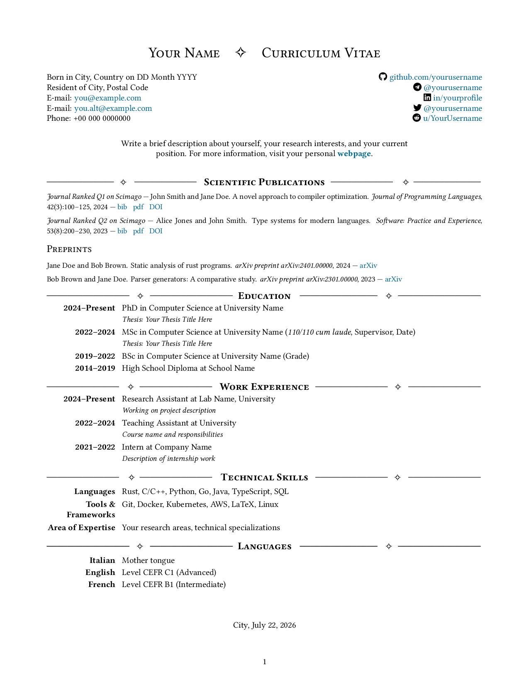
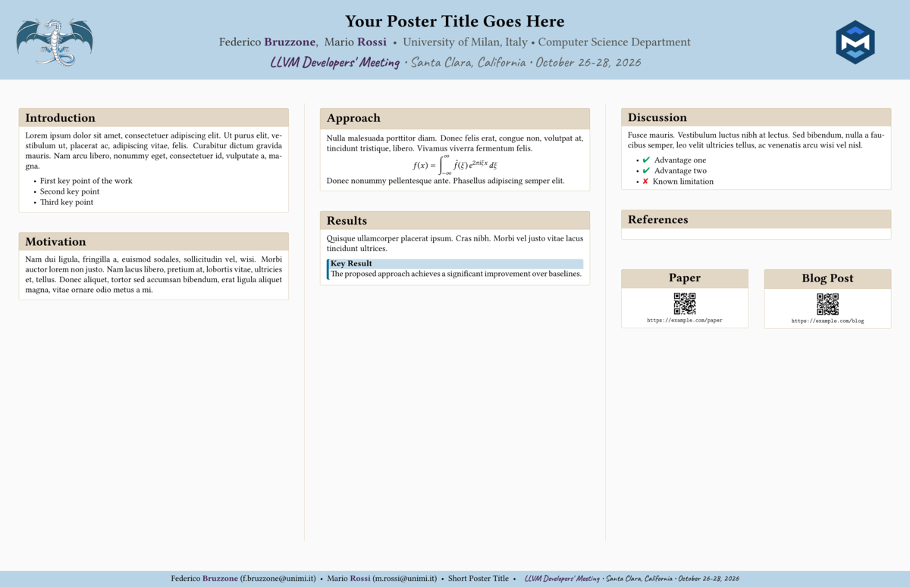

# `scribe`

**`scribe`** is a minimalist, opinionated $\LaTeX$ document class, beamer themes, and CV class for academic technical writing, presentations, posters, and resumes. 
<!-- It is designed to provide clean defaults, professional typography, and convenient commands for research papers, systematic literature reviews, technical reports, and presentations. -->
<!-- It is partially inspired by the `acmart` class. -->

<!-- [](example/onecolumn.pdf) -->
<!-- [](example/twocolumns.pdf) -->
<!-- [](example/twocolumnabstract.pdf) -->

<p align="center">
  <a href="example/onecolumn.pdf">
    
  </a>
  &nbsp;&nbsp;&nbsp;
  <a href="example/twocolumn.pdf">
    
  </a>
  &nbsp;&nbsp;&nbsp;
  <a href="example/twocolumnabstract.pdf">
    
  </a>
</p>

<p align="center">
  <a href="example-beamer/main.pdf">
    
  </a>
  &nbsp;&nbsp;&nbsp;
  <a href="example-beamer/main.pdf">
    
  </a>
  &nbsp;&nbsp;&nbsp;
  <a href="example-beamer/main.pdf">
    
  </a>
</p>

<p align="center">
  <a href="example-cv/main.pdf">
    
  </a>
</p>

<p align="center">
  <a href="example-poster/main.pdf">
    
  </a>
</p>

## Features

- **Minimalist Design**: Focuses on content with a clean, professional layout.
- **Full support** for all standard `article` class options.
- **Index Terms**: Use `\begin{indexterms}` to define keywords for indexing.
- **Line Numbers**: Optional line numbering for easy reference and review, placed reliably in the outer margin of each column (even in two-column layouts and across page breaks).
- **Callout boxes**: Colored boxes for asides — `info`, `warn`, `tip`, `note` out of the box, plus inline variants. Define your own with `\scribedefinebox{name}{color}`.
- **Theorem-like boxes**: Numbered, referenceable environments for `theorembox`, `definitionbox`, `lemmabox`, `corollarybox`, `propositionbox`, `examplebox`, `remarkbox`. They share one counter that restarts each section and support `\label`/`\ref`. Define your own with `\scribedefinetheorem{name}{Heading}{color}`.
- **Citation style**:
    - Compact numeric citations (e.g., [1–3,5])
    - Sorted in order of **first appearance**, not numerically
- **Named inline comments (toggleable)**: 
    - Define with `\scribedefinecomment{name}{color}`
    - Use with `\namecomment{...}`
    - Disable globally with `\scribeshowcommentsfalse`
- **Custom header mark**: `\scribesetrightmark{...}` sets right-side header text
- **Typography**:
    - Serif: **Libertine**
    - Monospace: **Inconsolata** (default; comment it out and uncomment the `beramono` line in the class to use **Bera Mono** instead)
- **Matching Beamer theme**: `beamerthemescribe` brings the same style to slides (see [below](#beamer-theme)).
- **Matching Poster theme**: `beamerthemescribeposter` brings the same style to large-format posters (see [below](#poster-theme)).
- **Matching CV class**: `scribecv` brings the same style to CVs and resumes (see [below](#cv--resume)).
- **Matching Matplotlib theme**: `matplotlib/` brings the same identity to figures (see [below](#matplotlib-theme)).

---

## LaTeX class

An example of a paper using the **`scribe`** class is provided in the `example` folder. 
Below is a minimal setup to have a one-column abstract in a two-column layout, with line numbers.

### 1. Add `scribe.cls` to your project folder.

### 2. In your main `.tex` file:

```latex
\documentclass[
    lineno, % Enable line numbers.
    letterpaper, % Use 'a4paper' for A4 size.
    twocolumn, % Comment for single column layout.
]{scribe} 

% Set right header mark (e.g., your name)
\scribesetrightmark{Federico Bruzzone} 

% Define different aliases (along with colors) for comments
\scribedefinecomment{fb}{orange}
% \scribedefinecomment{yourcolleague}{red}

% Uncomment the following line to hide comments in the final document.
% \scribeshowcommentsfalse 

\title{\textbf{An example paper using the scribe document class}}

\author{
    Federico Bruzzone \orcidlink{0000-0002-8701-8853} \\
    Computer Science Department \\
    Università degli Studi di Milano \\
    \href{mailto:federico.bruzzone@unimi.it}{\texttt{federico.bruzzone@unimi.it}} \\
    \url{https://federicobruzzone.github.io/} 
}

\date{September 2025}

\begin{document}

\twocolumn[
	\maketitle

	\begin{abstract}
        % Abstract text goes here. This is a brief summary of the document's content, highlighting the main objectives, methods, and findings.
	\end{abstract}

	\begin{indexterms}
        % Index terms for indexing purposes. These are keywords that help categorize the document's content.
	\end{indexterms}
]


% ==============================
% ========== Sections ==========
% ==============================
\input{sects/introduction}
\input{sects/background}


\bibliography{local}

\end{document}
```

### Callout and theorem boxes

```latex
% Callout boxes (no number): info, warn, tip, note are predefined.
\begin{infobox}{A title}
    Some highlighted aside.
\end{infobox}
Inline flavors too: \infoboxinline{info}, \warnboxinline{warn}.
% Define your own:
\scribedefinebox{question}{Purple}

% Theorem-like boxes (numbered, referenceable). theorembox, definitionbox,
% lemmabox, corollarybox, propositionbox, examplebox, remarkbox are predefined.
\begin{definitionbox}[Factorial] % optional note in brackets
    \label{def:factorial}
    The factorial of $n$ is $n! = \prod_{k=1}^{n} k$, with $0! = 1$.
\end{definitionbox}
As stated in Definition~\ref{def:factorial}, ...
% Define your own:
\scribedefinetheorem{conjecturebox}{Conjecture}{BrickRed}
```

All theorem-like boxes share one counter that restarts each section, so their
numbers are unique within a section (e.g. Theorem 2.1, Definition 2.2). Write the
kind by hand when referencing, as is customary: `Theorem~\ref{...}`.

## Beamer theme

**`beamerthemescribe`** brings the `scribe` identity to slides: the same Libertine
serif and Inconsolata monospace fonts, the `MidnightBlue` accent, the `\scribedivider`
ornament, colored dingbats, and the toggleable named-comment system. A full
example is in the `example-beamer` folder. As in the paper class, you can switch
the monospace font back to Bera Mono by editing the `\RequirePackage` lines in
`beamerthemescribe.sty`.


### 1. Add `beamerthemescribe.sty` to your project folder.

### 2. In your main `.tex` file:

```latex
\documentclass[
    aspectratio=169, % 16:9 slides. Use 'aspectratio=43' for classic 4:3.
]{beamer}

\usetheme{scribe} % The scribe beamer theme
% Theme options:
%   \usetheme[noframenumbers]{scribe} % hide the frame counter in the footer
%   \usetheme[nosectionpages]{scribe} % no automatic section divider slides

\title{An example presentation\\ using the scribe beamer theme}
\subtitle{Minimalist slides, matching the paper}
\author[F. Bruzzone]{Federico Bruzzone \orcidlink{0000-0002-8701-8853}}
\institute{Università degli Studi di Milano}
\date{May 2026}

% Define aliases (and colors) for comments, just like the paper class
\scribedefinecomment{fb}{orange}
% \scribeshowcommentsfalse % Uncomment to hide comments in the final slides

\begin{document}

\begin{frame}[plain,noframenumbering]
    \titlepage
\end{frame}

\section{Introduction} % Triggers an automatic divider slide

\begin{frame}{A clean first slide}
    \begin{itemize}
        \item Triangle bullets in the accent color
    \end{itemize}
    \scribedivider % The signature ✦ ornament works on slides too
\end{frame}

\end{document}
```

> **Note:** Frames that contain verbatim material (`\verb`, `lstlisting`, …)
> must be declared `\begin{frame}[fragile]`, as required by `beamer`.

## CV / Resume

**`scribecv`** brings the `scribe` identity to CVs and resumes: the same Libertine
serif and Inconsolata monospace fonts, the `MidnightBlue` accent, the `\scribedivider`
ornament, colored dingbats, callout boxes, and the toggleable named-comment system.
A full example is in the `example-cv` folder.

### Features

- **Entry layout**: Date (bold, right-aligned) + content (left-aligned) with optional details line
- **Section headings**: Small caps with horizontal rule, matching the Typst CV style
- **Two-column info block**: Personal information on the left, contact info on the right
- **Publication support**: Full citations from `.bib` via `bibentry` package (`\bibentry{key}`)
- **Contact icons**: `fontawesome5` icons for GitHub, LinkedIn, Telegram, Twitter, Reddit, etc.
- **Section heading styles**: Default centered (`---- ✧ ---- NAME ---- ✧ ----`) or fill-style (`NAME ---- ✧ ----` filling to the right margin). Enable fill-style with `\documentclass[sectionfill]{scribecv}`.
- **Optional header**: Show your name in the top-right corner of each page with `\documentclass[header]{scribecv}`.
- **Matching identity**: Same Libertine, MidnightBlue, `\scribedivider` as the paper class

### 1. Add `scribecv.cls` to your project folder.

### 2. In your main `.tex` file:

```latex
\documentclass{scribecv}
% Or with options:
% \documentclass[sectionfill,header]{scribecv}
%
% Options:
%   sectionfill - fill-style section headings (NAME ---- ✧ ----)
%   header      - show your name in the top-right header on each page

\scribesetrightmark{Your Name}

% Bibliography
\bibliographystyle{unsrt}
\scribenobibliography{cv.bib}  % loads .bbl data for inline citations

\begin{document}

\scribename{Your Name}
\scribesubtitle{Curriculum Vitae}

\scribeinfo{%
    Born in City, Country \\
    E-mail: \href{mailto:you@example.com}{you@example.com}%
}{%
    \faGithub\ \href{https://github.com/you}{github.com/you} \\
    \faTelegram\ \href{https://t.me/you}{@you} \\
    \faLinkedin\ \href{https://linkedin.com/in/you}{in/you} \\
    \faTwitter\ \href{https://x.com/you}{@you}%
}

\maketitle

\scribesection{Education}
\scribeentry{2020--2024}{PhD in Computer Science at University of X}{}
\scribeentry{2018--2020}{MSc in Computer Science at University of X}{Thesis: \textit{...}}

\scribesection{Publications}

% Journal paper format:
\noindent{\small\textit{Journal Name} --- \bibentry{author2024} ---~%
\href{url}{bib} \enspace \href{url}{pdf} \enspace \href{url}{DOI}}\par

\vspace{4pt}

% Preprint format:
\noindent{\small\bibentry{author2023} ---~%
\href{url}{arXiv}}\par

\scribesection{Experience}
\scribeentry{2024--Present}{Software Engineer at Company X}{Working on Y}

\scribefooter{City}
\end{document}
```

## Poster theme

**`beamerthemescribeposter`** brings the `scribe` identity to large-format academic
posters: Libertine serif via XeLaTeX/fontspec, `MidnightBlue` accent, amber block
headers, and the `\scribedivider` ornament. It is built on top of `beamer` +
`beamerposter` and targets landscape boards (tested at 170 × 110 cm / 6 ft × 4 ft).
A full example is in the `example-poster` folder.

### Features

- **Three-zone headline**: logo left · title/authors/date · logo right
- **tcolorbox blocks**: amber-tinted header, white body — three variants (`block`, `alertblock`, `exampleblock`)
- **Callout boxes**: same `info`, `warn`, `tip`, `note` as the paper class (and inline variants)
- **Column separator**: `\postercolumnsep` — a thin accent rule between content columns, auto-sized to the body height
- **QR codes**: `\qrcode` included out of the box
- **Footer**: author(s) + emails · title · date, all centered
- **Optional handwriting font**: `\fontcaveat{text}` for accents (requires Caveat, loaded in the document)

### 1. Add `beamerthemescribeposter.sty` to your project folder.

> **Note:** `beamerthemescribeposter` requires **XeLaTeX** (it uses `fontspec` and
> `unicode-math` for Libertine OTF). Do **not** compile with pdfLaTeX.

### 2. (Optional) Add the Caveat font

`\fontcaveat{...}` is a handwriting accent used for the date/conference line. To
enable it, download [Caveat](https://fonts.google.com/specimen/Caveat) and place
the static TTF files under `font/static/` in your project:

```
your-project/
├── main.tex
├── beamerthemescribeposter.sty
└── font/
    └── static/
        ├── Caveat-Regular.ttf
        └── Caveat-Bold.ttf
```

Then declare the font family in your preamble (before `\begin{document}`):

```latex
\newfontfamily\caveatfont[
    Path        = font/static/,
    UprightFont = Caveat-Regular.ttf,
    BoldFont    = Caveat-Bold.ttf,
]{Caveat}
```

If you don't need the handwriting font, simply omit the `\newfontfamily` declaration
and don't use `\fontcaveat`.

### 3. In your main `.tex` file:

```latex
% !TEX program = xelatex
\documentclass[final]{beamer}

\usepackage[
    orientation=landscape,
    size=custom,
    width=170,   % cm — adjust to your board
    height=110,  % cm
    scale=1.8,   % font scale: 1.8 → ~20 pt body, readable at ~1 m
]{beamerposter}

\usetheme{scribeposter}

% ---- Optional: Caveat handwriting font (see step 2) ----
\newfontfamily\caveatfont[
    Path        = font/static/,
    UprightFont = Caveat-Regular.ttf,
    BoldFont    = Caveat-Bold.ttf,
]{Caveat}

% ---- Logos (left and right of the headline) ----
\posterlogoleft{\includegraphics[height=9cm]{logo-left}}
\posterlogoright{\includegraphics[height=9cm]{logo-right}}

% ---- Metadata ----
\title{Your Poster Title Goes Here}
\author[F. Bruzzone]{Federico Bruzzone}
\institute{University of Milan, Italy}
\date{\fontcaveat{Conference Name \textbullet{} City \textbullet{} Date}}

% ---- Rich headline display (colors, \orcidlink, etc.) ----
\renewcommand{\posterauthordisplay}{%
    Federico \textcolor{scribecomplement}{\textbf{Bruzzone}}%
}
\renewcommand{\posterdatedisplay}{%
    \fontcaveat{Conference Name \textbullet{} City \textbullet{} Date}%
}

% ---- Footer contact info ----
\postercontact{f.bruzzone@unimi.it}

% Short title for the footer
\title[Short Title]{Your Poster Title Goes Here}

\begin{document}
\begin{frame}[t]
\vskip0.8cm

\posterbodycenter  % centers the column group between the outer margins
\begin{columns}[T, totalwidth=\textwidth]

\begin{column}{0.015\textwidth}\end{column}  % outer left margin

% ===== Column 1 =====
\begin{column}{0.30\textwidth}
    \begin{block}{Introduction}
        Body text here.
        \begin{itemize}
            \item First point
            \item Second point
        \end{itemize}
    \end{block}
\end{column}

\postercolumnsep  % thin accent rule between columns

% ===== Column 2 =====
\begin{column}{0.30\textwidth}
    \begin{block}{Approach}
        \begin{infobox}{Key Result}
            The proposed approach achieves a significant improvement.
        \end{infobox}
    \end{block}
\end{column}

\postercolumnsep

% ===== Column 3 =====
\begin{column}{0.30\textwidth}
    \begin{block}{References}
        \footnotesize
        \bibliographystyle{unsrt}
        \bibliography{local}
    \end{block}
\end{column}

\begin{column}{0.015\textwidth}\end{column}  % outer right margin

\end{columns}
\end{frame}
\end{document}
```

> **Column widths must sum to 1.0:** with three content columns and two separators,
> `2×0.015 + 3×0.30 + 2×0.035 = 1.000`. Adjust the separator width via
> `\postercolumnsep[<width>]` (default `0.035\textwidth`).

### Poster-specific commands

| Command | Description |
|---|---|
| `\posterlogoleft{<content>}` | Logo placed in the left column of the headline |
| `\posterlogoright{<content>}` | Logo placed in the right column of the headline |
| `\posterauthordisplay` | Override author display in the headline (full formatting freedom) |
| `\posterinstitutedisplay` | Override institute display in the headline |
| `\posterdatedisplay` | Override date display in the headline |
| `\postercontact{<content>}` | Contact info shown in the footer (replaces `\insertshortauthor` if set) |
| `\posterbodycenter` | Place immediately before `\begin{columns}` to center the body between outer margins |
| `\postercolumnsep[<width>]` | Thin accent rule separating content columns (default `0.035\textwidth`) |
| `\fontcaveat{<text>}` | Render text in Caveat (handwriting font); requires `\newfontfamily\caveatfont` |
| `\scribedefinecomment{name}{color}` | Define a named inline comment (same as the paper class) |

---

## Matplotlib theme

**`matplotlib/`** brings the `scribe` identity to figures: the `MidnightBlue`
accent (`#007091`) with its HSL complement, recessive axes (baseline spine
only, hairline y-only gridlines), and serif typography matching the paper's
Libertine via font substitution (no usetex/pgf dependency). Two files:

- `scribe-theme.mplstyle` — portable style sheet, usable from any repo via
  `plt.style.use("/path/to/scribe-theme.mplstyle")`, or copy/symlink it into
  `~/.matplotlib/stylelib/` to use it by name.
- `scribe_mpl.py` — shared palette and mechanics: `setup()` (loads the style),
  `style_axes()` (per-axis grid selection), `rounded_bars()` (rounded-top bar
  groups), `label_bars()`. It knows nothing about a given paper's entities —
  assign your data series to the palette in a small per-paper module.

```python
from scribe_mpl import setup, style_axes
setup()  # once, before creating any Axes
fig, ax = plt.subplots()
style_axes(ax)  # recessive axes, y-only gridlines
# ... plot ...
```

Reusing the theme in a new project: copy both files verbatim, then write a
small module mapping your entities to the palette colors.
