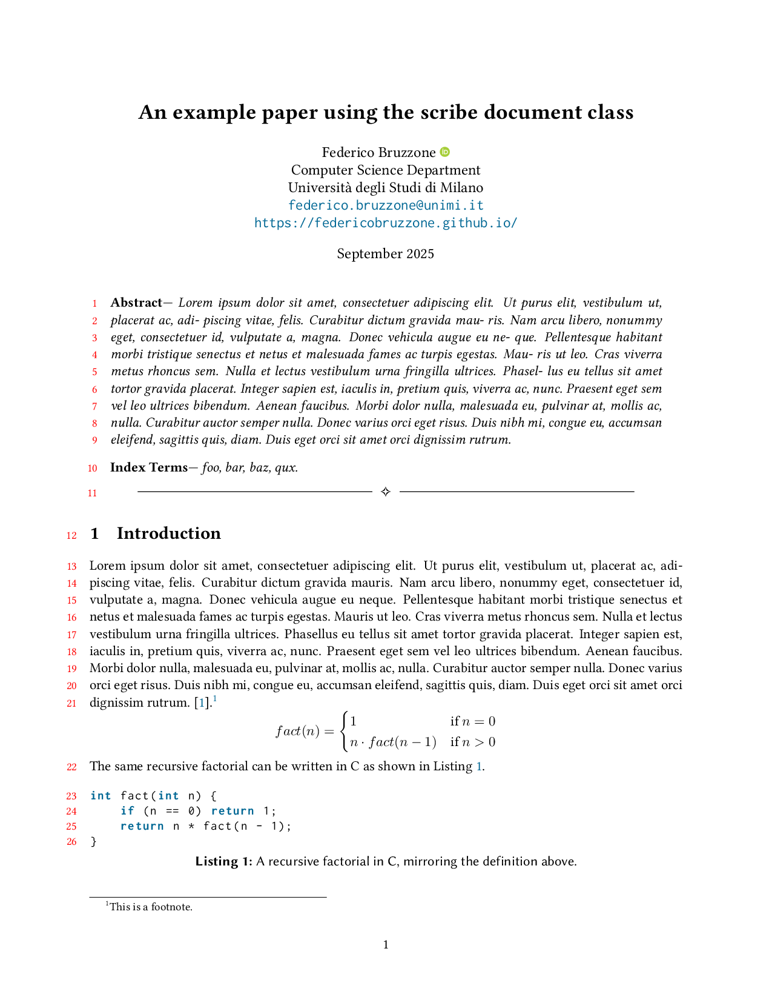
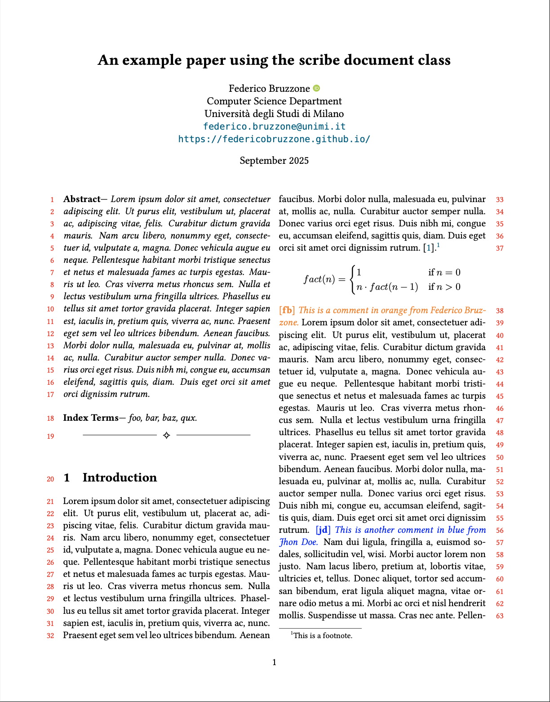
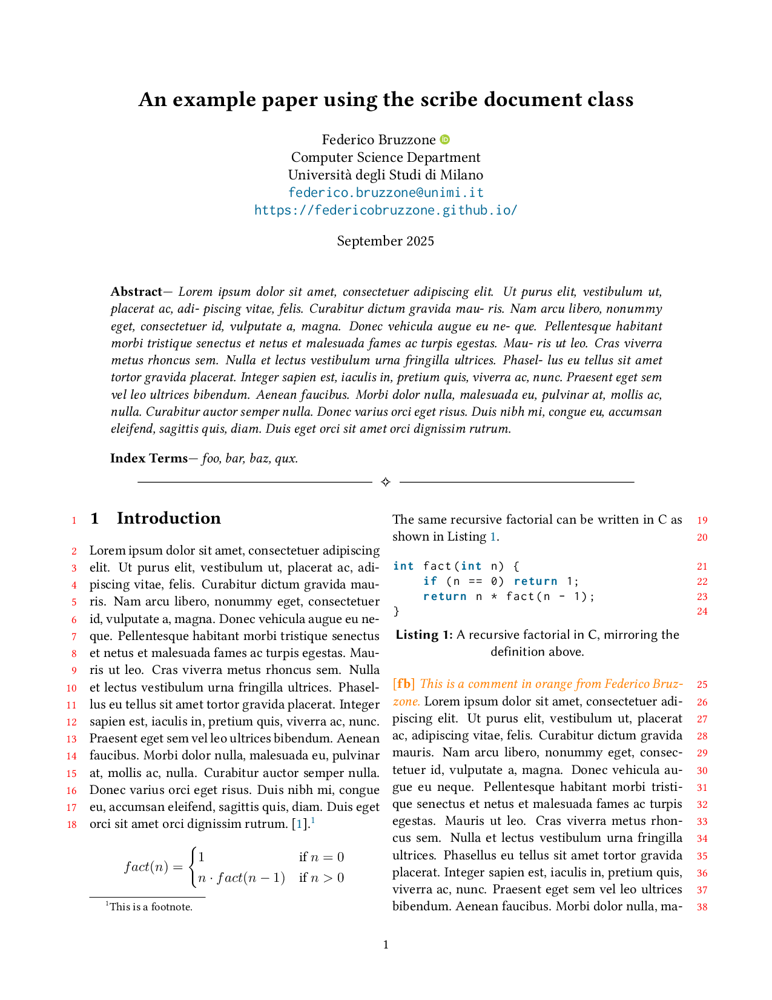
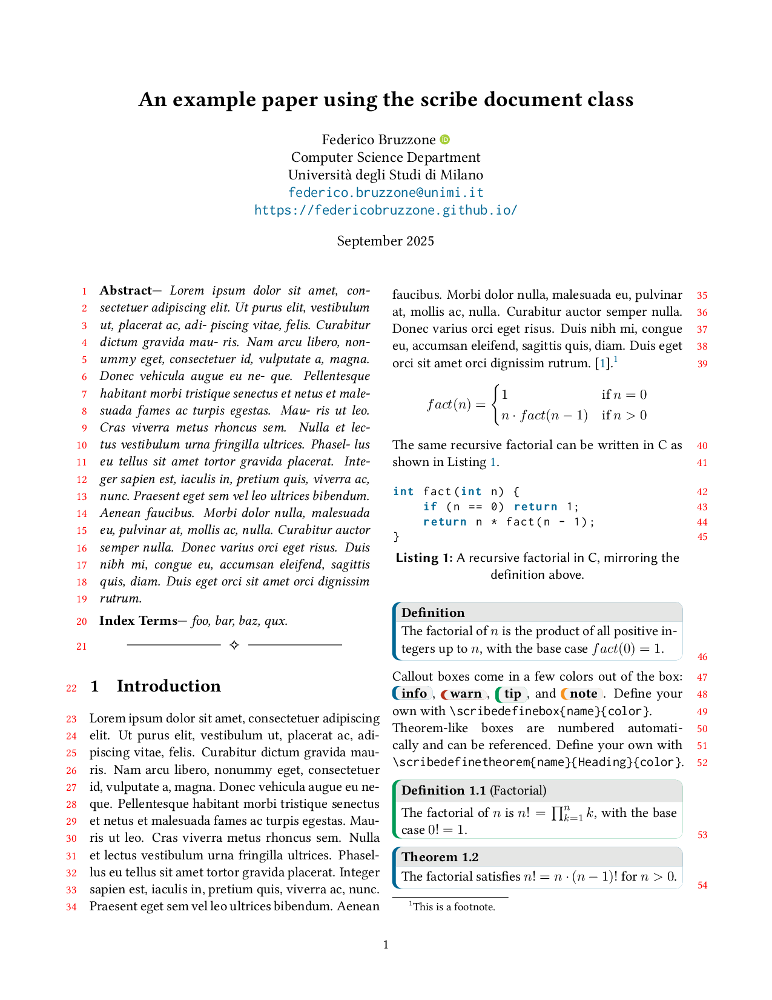
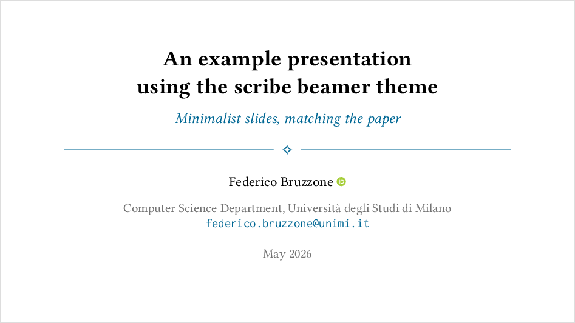
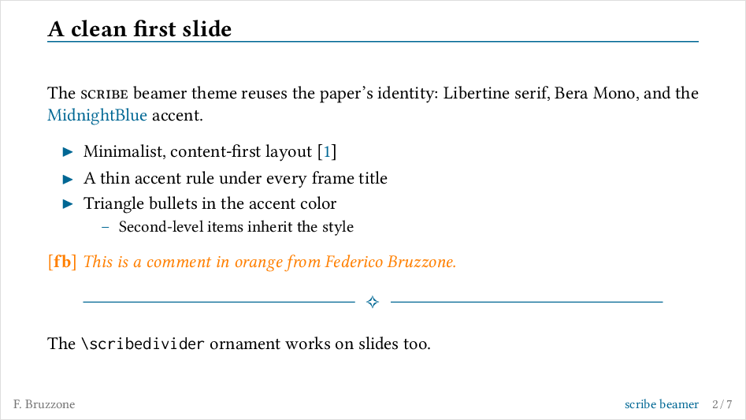
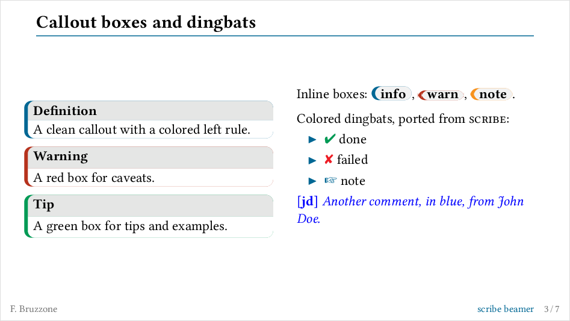

# `scribe`

**`scribe`** is a minimalist, opinionated $\LaTeX$ document class for academic and technical writing. It is designed to provide clean defaults, professional typography, and convenient commands for research papers, systematic literature reviews, and technical reports. It is partially inspired by the `acmart` class.

<!-- [](example/onecolumn.pdf) -->
<!-- [](example/twocolumns.pdf) -->
<!-- [](example/twocolumnabstract.pdf) -->

<p align="center">
  <a href="example/onecolumn.pdf">
    
  </a>
  &nbsp;&nbsp;&nbsp;
  <a href="example/twocolumn.pdf">
    
  </a>
  &nbsp;&nbsp;&nbsp;
  <a href="example/twocolumnabstract.pdf">
    
  </a>
</p>


---

## Features

- **Minimalist Design**: Focuses on content with a clean, professional layout.
- **Full support** for all standard `article` class options.
- **Index Terms**: Use `\begin{indexterms}` to define keywords for indexing.
- **Line Numbers**: Optional line numbering for easy reference and review.
- **Citation style**:
    - Compact numeric citations (e.g., [1–3,5])
    - Sorted in order of **first appearance**, not numerically
- **Named inline comments (toggleable)**: 
    - Define with `\scribedefinecomment{name}{color}`
    - Use with `\namecomment{...}`
    - Disable globally with `\scribeshowcommentsfalse`
- **Custom header mark**: `\scribesetrightmark{...}` sets right-side header text
- **Typography**:
    - Serif: **Libertine**
    - Monospace: **Inconsolata** (default; comment it out and uncomment the `beramono` line in the class to use **Bera Mono** instead)
- **Matching Beamer theme**: `beamerthemescribe` brings the same style to slides (see [below](#beamer-theme)).

---

## Usage

An example of a paper using the `scribe` class is provided in the `example` folder. 
Below is a minimal setup to have a one-column abstract in a two-column layout, with line numbers.

### 1. Add `scribe.cls` to your project folder.

### 2. In your main `.tex` file:

```latex
\documentclass[
    lineno, % Enable line numbers.
    letterpaper, % Use 'a4paper' for A4 size.
    twocolumn, % Comment for single column layout.
]{scribe} 

% Set right header mark (e.g., your name)
\scribesetrightmark{Federico Bruzzone} 

% Define different aliases (along with colors) for comments
\scribedefinecomment{fb}{orange}
% \scribedefinecomment{yourcolleague}{red}

% Uncomment the following line to hide comments in the final document.
% \scribeshowcommentsfalse 

\title{\textbf{An example paper using the scribe document class}}

\author{
    Federico Bruzzone \orcidlink{0000-0002-8701-8853} \\
    Computer Science Department \\
    Università degli Studi di Milano \\
    \href{mailto:federico.bruzzone@unimi.it}{\texttt{federico.bruzzone@unimi.it}} \\
    \url{https://federicobruzzone.github.io/} 
}

\date{September 2025}

\begin{document}

\twocolumn[
	\maketitle

	\begin{abstract}
        % Abstract text goes here. This is a brief summary of the document's content, highlighting the main objectives, methods, and findings.
	\end{abstract}

	\begin{indexterms}
        % Index terms for indexing purposes. These are keywords that help categorize the document's content.
	\end{indexterms}
]


% ==============================
% ========== Sections ==========
% ==============================
\input{sects/introduction}
\input{sects/background}


\bibliography{local}

\end{document}
```

---

## Beamer theme

**`beamerthemescribe`** brings the `scribe` identity to slides: the same Libertine
serif and Inconsolata monospace fonts, the `MidnightBlue` accent, the `\scribedivider`
ornament, colored dingbats, and the toggleable named-comment system. A full
example is in the `example-beamer` folder. As in the paper class, you can switch
the monospace font back to Bera Mono by editing the `\RequirePackage` lines in
`beamerthemescribe.sty`.

<p align="center">
  <a href="example-beamer/main.pdf">
    
  </a>
  &nbsp;&nbsp;&nbsp;
  <a href="example-beamer/main.pdf">
    
  </a>
  &nbsp;&nbsp;&nbsp;
  <a href="example-beamer/main.pdf">
    
  </a>
</p>

### 1. Add `beamerthemescribe.sty` to your project folder.

### 2. In your main `.tex` file:

```latex
\documentclass[
    aspectratio=169, % 16:9 slides. Use 'aspectratio=43' for classic 4:3.
]{beamer}

\usetheme{scribe} % The scribe beamer theme
% Theme options:
%   \usetheme[noframenumbers]{scribe} % hide the frame counter in the footer
%   \usetheme[nosectionpages]{scribe} % no automatic section divider slides

\title{An example presentation\\ using the scribe beamer theme}
\subtitle{Minimalist slides, matching the paper}
\author[F. Bruzzone]{Federico Bruzzone \orcidlink{0000-0002-8701-8853}}
\institute{Università degli Studi di Milano}
\date{May 2026}

% Define aliases (and colors) for comments, just like the paper class
\scribedefinecomment{fb}{orange}
% \scribeshowcommentsfalse % Uncomment to hide comments in the final slides

\begin{document}

\begin{frame}[plain,noframenumbering]
    \titlepage
\end{frame}

\section{Introduction} % Triggers an automatic divider slide

\begin{frame}{A clean first slide}
    \begin{itemize}
        \item Triangle bullets in the accent color
    \end{itemize}
    \scribedivider % The signature ✦ ornament works on slides too
\end{frame}

\end{document}
```

> **Note:** Frames that contain verbatim material (`\verb`, `lstlisting`, …)
> must be declared `\begin{frame}[fragile]`, as required by `beamer`.
